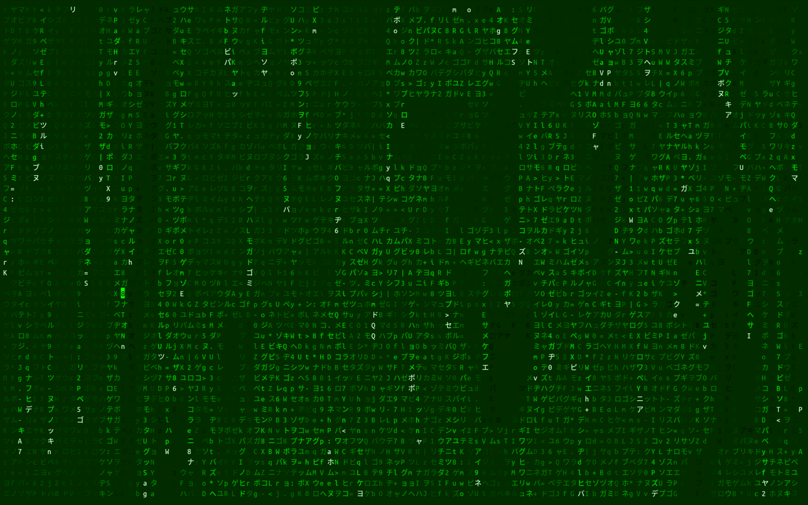
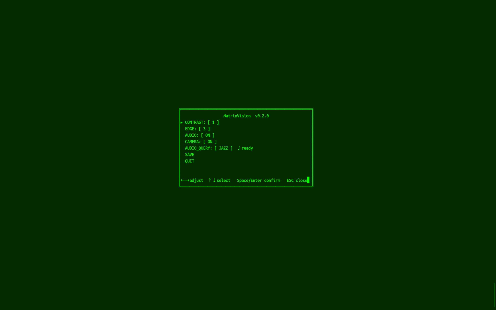

# MatrixVision / 终端 Matrix 数字雨

终端版 Matrix 数字雨，摄像头亮度实时驱动字符亮度与变化。适合外接竖屏，支持全屏 cover 填充，保持摄像头原始比例。

Terminal Matrix digital rain driven by live camera brightness. Designed for vertical monitors with full-screen cover fill and original camera aspect ratio preserved.

## 快速开始 / Quick Start

### 一键安装 / One-Command Install

```bash
# 1. 克隆仓库
git clone https://github.com/ShallowWaterLab/MatrixVision.git
cd MatrixVision

# 2. 一键安装所有依赖
bash install.sh
```

安装脚本会自动完成：
- 检测系统并安装 `ffmpeg`
- 创建 Python 虚拟环境并安装 `opencv-python-headless` + `numpy`
- 安装 `yt-dlp`（在线音乐依赖）
- 配置启动脚本

### 运行 / Run

```bash
# 方式1：直接运行（推荐）
./run.sh

# 方式2：使用全局命令（安装后可直接在任何目录运行）
MatrixVision

# 指定摄像头与分辨率
./run.sh 0 1280 720
```

### 手动运行（不通过安装脚本）/ Manual Run

```bash
# 创建虚拟环境
python3 -m venv .venv
source .venv/bin/activate

# 安装依赖
pip install opencv-python-headless numpy

# 运行
python3 src/rain.py
```

## 架构 / Architecture

- `ESC`：打开/关闭设置页 / Open/close settings menu
- `Space` / `Enter`：确认 / Confirm
- `↑` / `↓`：选择菜单项 / Select menu item
- `←` / `→`：调整数值 / Adjust value
- `Ctrl+C` / `Q`：退出 / Quit

## 设置项 / Settings

- **CONTRAST**：CLAHE 对比度增强，0=关闭，1-3=增强强度 / CLAHE contrast enhancement, 0=off, 1-3=intensity
- **EDGE**：Sobel 边缘增强，0=关闭，1-3=增强强度 / Sobel edge enhancement, 0=off, 1-3=intensity
- **AUDIO**：在线音频开关 / Online audio toggle
- **CAMERA**：摄像头采集开关 / Camera capture toggle
- **AUDIO_QUERY**：预设电台切换 / Preset radio switching
- **SAVE**：保存当前设置到 `src/matrixvision.json` / Save current settings
- **QUIT**：退出程序 / Quit

## 特性 / Features

- 摄像头亮度直接映射字符亮度 / Camera brightness directly maps to character brightness
- 两层亮度分离：雨头/拖尾独立衰减，摄像头背景直接跟踪无拖影 / Two-layer brightness: trail decay + camera background tracking without ghosting
- 反色固定开启 / Invert always on
- 全屏 cover 裁剪，保持摄像头原始比例 / Full-screen cover crop, keeps original camera aspect ratio
- 背景字符随亮度变化随机换字 / Background characters randomize on brightness changes
- 字符集：半角片假名 + ASCII，与 MatrixMix 一致 / Charset: half-width katakana + ASCII, consistent with MatrixMix
- 自动备份：每次启动自动备份到 `src/backups/`（最多 20 个） / Auto backup to `src/backups/` on every launch (max 20)

## 环境变量 / Environment Variables

| 变量 Variable | 说明 Description | 默认值 Default |
|------|------|--------|
| MATRIXMIX_FPS | 渲染帧率 Render FPS | 16 |
| MATRIXMIX_SPEED | 雨流速度倍率 Rain speed multiplier | 1 |
| MATRIXMIX_INVERT | 启动时启用反色 Invert on startup | true |
| MATRIXMIX_CONTRAST | 启动时对比度档位 0-3 Contrast level at startup | 2 |
| MATRIXMIX_EDGE | 启动时轮廓档位 0-3 Edge level at startup | 2 |
| MATRIXMIX_AUDIO | 启动时启用音频 Enable audio on startup | 1 |
| MATRIXMIX_QUERY | 默认音乐查询词 Default music query | ytsearch1:lofi hip hop radio |

## 依赖 / Dependencies

- Python 3.10+
- OpenCV 5.0.0
- NumPy 2.4.6
- ffmpeg
- yt-dlp

## 架构 / Architecture

### 预览 / Preview

| 主界面 Main | 设置页 Settings |
|------|------|
|  |  |

详见 / See [ARCHITECTURE.md](ARCHITECTURE.md) for details.
